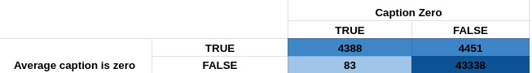

# Inteligencia Artificial I - Informe Proyecto Final.

``` json
// TODO Table of content
```

## Heartbreak: Modelo para detectar cuentas falsas de Instagram

**Integrantes:** 
  - Nahuel Arrieta
  - Leonel Castinelli.

**Repositorio:** https://github.com/NahuelArrieta/ia2023-heartbreak

## Descripción

### Sobre el proyecto
En el marco de la materia Inteligencia Artificial I de la Licenciatura en Ciencias de la Computación de la Universidad Nacional de Cuyo, se propone la realización de un proyecto final que consiste en crear un módelo capaz de detectar cuentas falsas de Instagram.

Instagram es una red social con una gran popularidad, cuya principal función es compartir fotos y videos. El sistema de interacción se basa en seguir a otros usarios, por lo cual cada cuenta tiene seguidores y seguidos. Además de las publicaciones, cada cuenta tiene una biografía, una imagen de perfil y puede tener un link externo.

### Objetivo
La masificación de las redes sociales ha llevado a la creación de cuentas falsas que buscan engañar a los usuarios. 

Detectar estas cuentas es de vital importancia por varias razones:
- En primer lugar, las cuentas falsas pueden ser utilizadas para difundir información errónea o engañosa, lo cual puede tener consecuencias negativas para los usuarios y la sociedad en general. 
- Además, estas cuentas a menudo están involucradas en actividades fraudulentas, como estafas y phishing, que ponen en riesgo la seguridad y privacidad de los usuarios legítimos. 
- Las cuentas falsas también pueden inflar artificialmente los números de seguidores y engagement, lo que distorsiona las métricas y afecta la credibilidad de influencers y marcas. Esto puede llevar a decisiones empresariales erróneas basadas en datos falsos. 
- Finalmente, la proliferación de cuentas falsas puede afectar la experiencia general del usuario, reduciendo la confianza en la plataforma y llevando a una menor interacción y satisfacción de los usuarios auténticos. 

Por todas estas razones, contar con un modelo que permita a Instagram detectar cuentas falsas de manera automática y eficiente es de suma importancia. El mismo contribuiría a mantener la confianza de los usuarios en la plataforma, promoviendo una experiencia más auténtica y satisfactoria. 


### ¿Qué es una cuenta falsa? 
Una cuenta falsa es una cuenta de usuario en una red social que no representa a una persona real. Si bien pueden parecer fácil de identificar debido a ciertas características, como la falta de una imagen de perfil o poca actividad, muchos usuarios reales poseen también este comportamiento.  Dar una definición precisa de que es una cuenta falsa no es sencillo, ya que no existe un criterio único que permita identificarlas de manera inequívoca. Esto va a decantar en un gran desafío a la hora de testear la performance del modelo en un entorno real.

Por lo tanto, el modelo que se propone en este proyecto no tiene como objetivo identificar cuentas falsas de manera absoluta, sino detectar patrones y características comunes en cuentas que han sido identificadas como falsas en el pasado.


### Implementación
Se utilizará un algoritmo de machine learning entrenado con un dataset de la plataforma kaggle (https://www.kaggle.com/datasets/krpurba/fakeauthentic-user-instagram) el cuál ha recopilado datos de 65326 usuarios reales o auténticos y falsos desde el 1 al 20 de septiembre de 2019, lo cual resulta ser de grán utilidad ya que contiene muchas métricas de cada usuario. Además de ser muy extensa, contiene datos muy interesantes como: 

- Average Caption length: Longitud promedio de descripción en publicaciones.

- Average Hashtags count: Cantidad promedio de hashtags en publicaciones.

- Biography length: Longitud de la biografía.

- Caption Zero: Porcentaje de publicaciones con longitud de la descripición menor a 4 caracteres.

- Comments engagement rate: (número de comentarios) dividido por (número de publicaciones) dividido por (número de seguidores).

- Cosine similarity: Similaridad coseno promedio entre cada par de publicaciones.

- Follower keywords: Uso promedio de palabras "follower hunter" (follow, like, folback, follback, f4f) por publicación.

- Has Picture: Si la cuenta tiene imagen de perfil.

- Like engagement rate: (número de likes) dividido por (número de publicaciones) dividido por (número de seguidores).

- Link Availibility: Si la cuenta tiene un link externo.

- Location tag percentage: Porcentaje de publicaciones con tag de ubicación.

- Non image post percentage: Porcentaje de publicaciones que no son imágenes (video, carousel).

- Number of followers: Número de seguidores.

- Number of followings: Número de seguidos.

- Number of posts: Número de publicaciones.

- Post interval: Intervalo de tiempo en horas entre publicaciones.

- Promotional keywords: Uso promedio de palabras "promocionales" (regrann, contest, repost, giveaway, mention, share, give away, quiz) por publicación.


## Organización del proyecto

### Planificación de las actividades
En el anteproyecto se planteó la siguiente planificación:

- **Actividad 1:** Recopilar información.**[5 días]**

- **Actividad 2:** Limpiar la información.**[4 días]**

- **Actividad 3:** Preprocesamiento de datos.**[4 días]**

- **Actividad 4:** Selección de los conjuntos de entrenamiento y prueba.**[4 días]**

- **Actividad 5:** Entrenamiento del modelo. **[5 días]**

- **Actividad 6:** Validación del modelo y análisis de las métricas resultantes. **[3 días]** 

- **Actividad 7:** Ajustes al modelo. **[4 días]**

- **Actividad 8:** Elaboración del informe final. **[4 días]**


### Desarrolo de las actividades
El proceso de desarrollo del proyecto se vió afectado por la falta de tiempo de los integrantes debido a cuestiones personales y laborales, y se reaizó en dos etapas.

La primera se empezó en noviembre de 2023 y en ella se recopiló información, se limpió y preprocesó los datos, y se seleccionaron los conjuntos de entrenamiento y prueba. Además se comenzó con el entrenamiento del modelo, pero no se conluyó. Se reanudo con el poryecto, en una segunda fase, en junio de 2024 y se completaron las actividades de entrenamiento del modelo, validación y ajustes al modelo. El informe final se fue completando a medida que se realizaban las actividades. 

La carga de trabajo no fue constante a lo largo del proyecto, sino que cadda alumno se encargó de las tareas de forma individual en el momento que le fue posible. A continuación se detallan los tiempos tomados en cada actividad:

- **Actividad 1:** Recopilar información.**[6 días]**

- **Actividad 2:** Limpiar la información.**[1 día]**

- **Actividad 3:** Preprocesamiento de datos.**[1 día]**

- **Actividad 4:** Selección de los conjuntos de entrenamiento y prueba.**[1 día]**

- **Actividad 5:** Entrenamiento del modelo. **[7 días]**

- **Actividad 6:** Validación del modelo y análisis de las métricas resultantes. **[2 días]** 

``` json
// TODO: Agregar tiempo real de las actividades 7 y 8.
```

Si bien se ha relizado trabajo por fuera de esta plataforma, todo el código y la documentación se encuentra en el repositorio de github. Por lo tanto el gráfico de contribuciones resulta útil para visualizar los tiempos de trabajo empleados:
 


``` json
// TODO: Actualizar gráfico de contribuciones una vez finalizado el proyecto.
``` 

``` json
// TODO: Agregar gráfico de Gantt con la planificación real.
``` 

## Investigación 

### Análisis de la features del dataset

- Average Caption length (en escala logarítmica)


- Average Hashtags count (en escala logarítmica)


- Biography length 


- Caption Zero 


- Comments engagement rate (en escala logarítmica)


- Cosine similarity


- Follower keywords (en escala logarítmica)


- Has Picture


- Like engagement rate (en escala logarítmica)


- Link Availibility


- Location tag percentage


- Non image post percentage


- Number of followers (en escala logarítmica)


- Number of followings 


- Number of posts (en escala logarítmica)


- Post interval (en escala logarítmica)


- Promotional keywords (en escala logarítmica)


#### Conclusiones

- La distribución de las clases (real o fake) es equitativa, lo cual es bueno para el entrenamiento del modelo.


- Podría considerarse utilizar como feature la diferencia entre el número de seguidores y seguidos (followers - following).


- La característica "Caption Zero" no es muy útil ya que los unicos valores que toma son 0 y 1. Además algunos datos son incorrectos ya que hay 83 cuentas que no tienen descripcion en sus publicaciones (la longitud promedio de descripción en publicaciones es 0) pero el valor de la característica es 0.




- Las siguientes características tienen una distribución muy similar entre las clases real y fake. En principio, no serían muy útiles para el entrenamiento del modelo.

  - Non image post percentage
  - Location tag percentage
  - Comments engagement rate

- Las siguientes características tienen una distribución muy diferente entre las clases real y fake. Podrían ser muy útiles para el entrenamiento del modelo.

  - Biography length 
  - Follower keywords
  - Has Picture
  - Link Availibility
  - Promotional keywords 

- Las siguientes características se podrían añadir para denotar más relaciones entre las características del dataset:

  - Follow difference: Diferencia entre el número de seguidores y seguidos.
  - Rate of follows: Cantidad de followers dividida la cantidad de following.
  - Post frecuency: Cantidad de posts dividida el post interval(intervalo de posteos). 
  - Account age: Antigüedad de la cuenta. Se puede calcular en base a la cantidad de posts y el post interval.
  - Follower frequency: Cantidad de followers dividida la antigüedad de la cuenta.
  - Following frequency: Cantidad de following dividida la antigüedad de la cuenta.
  - Images frequency: Cantidad de imágenes dividida la antigüedad de la cuenta.

### Análisis de los algoritmos disponibles.
¿Qué algoritmos podemos usar para este problema de clasificación?

Para un problema de clasificación existen varios algoritmos que podemos considerar:

- **Regresión Logística:** es un algoritmo lineal utilizado para la clasificación binaria. Estima la probabilidad de pertenecer a una clase específica.
- **Árboles de Decisión:** este algoritmo crea un modelo en forma de árbol, donde cada nodo representa una característica y cada rama representa una decisión o un resultado. Es utilizado tanto para clasificación binaria como para clasificación multiclase.
- **Bosques Aleatorios (Random Forest):** es un conjunto de árboles de decisión que trabajan en paralelo y generan predicciones. Cada árbol en el bosque vota por la clase a la que pertenece, y la clase con más votos se selecciona como la predicción final.
- **Máquinas de Vectores de Soporte (SVM):** este algoritmo encuentra un hiperplano óptimo que separa las clases en un espacio de alta dimensión. Es utilizado tanto para clasificación binaria como para clasificación multiclase.
- **Naive Bayes:** este algoritmo se basa en el teorema de Bayes y asume que todas las características son independientes entre sí. Es rápido y eficiente en términos de recursos computacionales.
- **Redes Neuronales Artificiales (ANN):** estas son estructuras que imitan el funcionamiento del cerebro humano. Pueden ser utilizadas para problemas de clasificación tanto binaria como multiclase, pero pueden requerir más datos y recursos computacionales.
- **K-Nearest Neighbors (KNN):** este algoritmo clasifica un punto de datos basado en la clase de sus vecinos más cercanos. Es simple y fácil de implementar, pero puede ser lento con grandes conjuntos de datos.

Cabe destacar que la elección del algoritmo adecuado depende del problema específico, los datos disponibles y las características del conjunto de datos.


**Regresión Logística o Regresión Lineal.**

Este algoritmo es una buena opción para este problema de clasificación pero debido a que queremos aprovechar el dataset amplio del que disponemos, buscaremos usar un algoritmo más potente cómo Random Forest.

**Árboles de decisión.**

Debido a la gran cantidad de valores que tenemos en el dataset buscaremos usar un algoritmo que pueda encontrar las relaciones no obvias en el dataset, además de que es sensible al sobreajuste. Para esquivar estas desventajas buscaremos usar Random Forest que es más dificil de realizar un sobreajuste y además es menos sensible al cambio de las variables.

**Bósques aleatorios (Random Forest)**

Este algoritmo nos parece el ideal ya que puede aprovecharse de las relaciones que existen entre las variables predictoras y es menos sensible al sobreajuste, además de lograr aprovechar el tamaño de nuestro dataset.

**Máquinas de Vectores de Soporte.**

El algoritmo MVS da excelentes resultados en estos problemas de clasificación pero no tiene buena performance con datasets grandes, como es nuestro caso. Además de que requiere una gran capacidad de cómputo por su complejidad temporal de O(dn<sup>2</sup>), lo cual se volvería muy costoso debido al tamaño del dataset.

**Algoritmo Naive Bayes.**

El principal problema del uso de este algoritmo es que se asume que las variables no tienen ninguna correlación entre sí, lo cual es falso en nuestro dataset, por ejemplo, la cantidad de seguidores y el comments engagement rate estarán relacionados implícitamente.

**Redes Neuronales.**

Estos algoritmos quedan descartados ya que exceden el alcance de la cátedra.

**K-Nearest Neighbors.**
La principal desventaja de este algoritmo es que es lento en la fase de predicción, ya que necesita calcular la distancia entre el punto a clasificar y todos los puntos del conjunto de entrenamiento. Además, no es muy efectivo con datasets grandes, como es nuestro caso.

#### Conclusión.

Debido al gran tamaño del dataset y la gran cantidad de parámetros, podemos aprovecharlos en Random Forest generando árboles con conjuntos variables predictoras distintas que denotarán relaciones que sean altamente efectivas en la detección de si un perfil de instagram es real o falsa, como por ejemplo: Número de followers y following.

Además, para comparar los resultados obtenidos con Random Forest, se realizarán implementaciones sencillas con los siguientes algoritmos: 
- Regresión Logística.
- Árboles de Decisión.
- KNN.
- Naive Bayes.

## Entorno de trabajo

### Random Forest en R
Para el entrenamiento del modelo Random Forest en R se utilizó la librería `randomForest`, la cual provee las funciones necesarias para entrenar el modelo y realizar las predicciones sobre el conjunto de test para luego evaluar el rendimiento del modelo.

``` r
## Train the model
model <- randomForest(
    formula = is_fake ~ .,
    data = dataframe,
    ntree = ntree,
    mtry = mtry,
    na.action = na.omit
)

## Predict the classes
test_dataframe$prediction_class <- predict(model, newdata = test_dataframe, type = "class")
```

Para poder realizar el prepocesamiento necesario en los datos, se definió en el archivo `code/utils.R` todas las funciones necesarias para realizar las transformaciones requeridas. Por ejemplo para poder eliminar las variable 'non_image_post_percentage':
  
``` r
## Remove non image post percentage
remove_non_image_post_percentage <- function(dataframe) {
      dataframe <- dataframe[, -which(names(dataframe) == "ni")]
      return(dataframe)
}
```

Se definió una función que dada una lista de parametros denominada `train_variables` se encarga de llamar a esas funciones para realizar el preprocesamiento de los datos.

``` r
## Set the variables to train the model
train_variables <- list(
    ntree = 100,
    mtry = 5,
    scale_data = FALSE,
    remove_non_image_post_percentage = TRUE,
    remove_location_tag_percentage = TRUE,
    remove_comments_engagement_rate = FALSE,
    remove_caption_zero = TRUE, 
    add_follow_difference = FALSE,
    add_follow_rate = FALSE,
    add_account_age = FALSE,
    add_follower_frequency = FALSE,
    add_following_frequency = FALSE,
    add_image_frequency = FALSE
)

## Train the model
model <- train_model(train_variables)
```

Además se creó una función que se encarga de evaluar el rendimiento del modelo y generar un archivo `.md` dentro de la carpeta `results` para cada prueba realizada y así comparar los resultados obtenidos con distintas configuraciones de hiperparámetros.
Estos archivos contienten información sobre la configuración utilizada, la matriz de confusión y la importancia de cada variable en el modelo. 


### Otros algorithmos en Python
Para los algoritmos de Regresión Logística, Árboles de Decisión, KNN y Naive Bayes se utilizó la librería `sklearn` de Python. La implemetnación se basó en una clase `Model` que contiene los métodos necesarios para entrenar el modelo, realizar las predicciones y evaluar el rendimiento del modelo.

``` python

class Model:
    def __init__(self, model, name):
        self.model = model
        self.name = name
        self.avg_time = 0
        self.avg_accuracy = 0
    
    def train(self, X_train, y_train):
        self.model.fit(X_train, y_train)

    def test(self, X_test, y_test):
        accuracy = self.model.score(X_test, y_test)
        return accuracy
    
    def print_results(self):
        print('\n')
        print('Model:', self.name)
        print('Average accuracy:', self.avg_accuracy)
        print('Average time (s):', self.avg_time)
        print('-----------------------------------')

    
    def run(self, X_train, y_train, X_test, y_test, n):
        train_time = 0
        accuracy = 0

        for i in range(n):
            start = time.time()
            self.train(X_train, y_train)
            train_time += time.time() - start

            accuracy += self.test(X_test, y_test)

        self.avg_time = train_time / n
        self.avg_accuracy = accuracy / n 
```

Luego de esto, se creó una instancia de la clase `Model` para cada algoritmo y se llamó al método `run` un determinado número de veces para obtener el rendimiento promedio del modelo.

``` python
## Run the models
iterations = 5
models = [logistic_regression, knn, decision_tree, naive_bayes]
for model in models:
    model.run(X_train, y_train, X_test, y_test, iterations)
    model.print_results()
``` 


## Entrenamiento del modelo
En base a la investigación realizada, se desarolló código para poder aplicar las modificaciones y se entrenó el modelo con el algoritmo Random Forest. Se realizaron varias pruebas con distintas configuraciones de hiperparámetros y se evaluaron los resultados obtenidos.

A continuación se presentan los de las pruebas realizadas:

### 1- Modelo sin preprocesamiento
El primer modelo se entrenó sin realizar ningún tipo de preprocesamiento en los datos, con el objetivo de evaluar las modificaciones que se pueden realizar en el dataset para mejorar el rendimiento del modelo. Se utilizaron 100 árboles y 5 variables predictoras en cada árbol.

Los resultados de la matriz de confusión fueron las siguientes:
 | | **Predicted Positive**| **Predicted Negative** | |
 |:--:|:--:|:--:|:--:|
 | **Actual Positive** | TP:  6224  | FN:  285  | Sensitivity:  0.956214472269166  |
 | **Actual Negative** | FP:  1083  | TN:  5474  | Specificity:  0.834833002897667  |
 | | Precision:  0.851785958669769  | Negative Predictive Value:  0.95051224170863  | **Accuracy**:  0.895300780652074  |

Además se obtuvo la importancia de las diferentes variables:
 | Variable | Importance |
 |:--:|:--:|
 |  Num posts |  459.761258190958  |
 |  Num followers  |  735.805088278248  |
 |  Num following  |  2091.16579555838  |
 |  Bio length  |  627.457577048002  |
 |  Has picture  |  13.2295974190987  |
 |  Link zvailability  |  2153.48815752171  |
 |  Avg caption length  |  534.722734277606  |
 |  Caption zero  |  266.496444291937  |
 |  Non image percentage  |  168.669221114669  |
 |  Like engagement rate  |  1448.20487223423  |
 |  Comments engagement rate  |  2152.98693259071  |
 |  Location tag percentage  |  600.213569894813  |
 |  Average hashtag count  |  199.270343752644  |
 |  Promotional keywords   |  195.66162222508  |
 |  Followers keywords  |  122.984566460685  |
 |  Cosine similarity  |  354.513301793794  |
 |  Post interval  |  495.154604529331  |

Las primeras conclusiones que se pueden obtener de este modelo son:
- Contrariamente a lo que se esperaba, la característica "Comments engagement rate" resultó ser una de las más importantes para la clasificación de las cuentas.
- Las características "Follower keywords",  "Has Picture" y "Non image percentage" son las menos importantes para el modelo.
- Las variables "Location tag percentage", "Bio length", "Post interval" y "Promotional keywords" no tuvieron el impacto que esperábamos cuando analizamos el dataset.

### 2- Dataset con followers-following ratio
Al dataset se le incluyó una feature denominada "follow_rate" que representa la relación entre el número de seguidores y seguidos de una cuenta. 

La importancia que tuvo esta nueva característica en el modelo fue de 2366.98, siendo la más importante de todas las variables. Además se notó una importante disminución en la importancia de las variables "Num followers" (de 735.80 a 413.23) y "Num following" (de 2091.17 a 1104.46). 

En cuanto a los resultados, el se obtuvo una mejora en la accuracy del modelo, pasando de 0.8953 a 0.8973.

### 3- Dataset con antigüedad de la cuenta
Se agregó una característica al dataset denominada "account_age" que representa la antigüedad de la cuenta. Se calculó multiplicando el número de publicaciones por el intervalo de tiempo entre publicaciones, lo cual nos da un indicio de cuánto tiempo lleva la cuenta activa; sin embargo si la cuenta no ha publicado nada, la antigüedad será 0.

Esta nueva feature no fue muy útil ya que su importancia fue de 437.20 y la accuracy disminuyó ligéramente a 0.8941.

### 4- Dataset con followers frequency
En esta prueba se añadió una nueva feature al dataset denominada "followers_frequency" que representa la cantidad de seguidores dividida la antigüedad de la cuenta.

Al igual que la prueba anterior, esta nueva característica tuvo una baja  importancia en el modelo (355.15) y el accuracy disminuyó a 0.8937.

### 5- Dataset con following frequency
Para este entrenamiento se añadió una feature denominada "following_frequency" que representa la cantidad de seguidos dividida la antigüedad de la cuenta. 

En esta caso la variable tuvo una importancia alta (1177.64) y la importancia de "Num following" disminuyó a 1598.15. La accuracy del modelo fue de 0.8960.

### 6- Dataset con image frequency
Se añadió una nueva feature al dataset denominada "image_frequency" calculada como la cantidad de imágenes dividida la antigüedad de la cuenta. Nuevamente, los resultados no fueron los esperados ya que la importancia de la variable fue de 332.48 y la accuracy del modelo bajó a 0.8944.

### 7- Escalado de variables
En esta prueba se escaló el dataset utilizando la función `scale` de la librería `sklearn.preprocessing`, con el objetivo de normalizar las variables y mejorar el rendimiento del modelo.

Sin embargo, los resultados no fueron los esperados ya que la cantidad de falsos negativos aumentó considerablemente (de 285 a 1805), lo que se tradujo en una disminución de la accuracy del modelo a 0.7766.

### 8- Eliminación de variables 
En base al primer análisis de las variables del dataset se consideró eliminar las siguientes variables debido a que su distribución era muy similar entre las clases real y fake:
- Non image post percentage
- Location tag percentage
- Comments engagement rate
- Caption zero

En este caso la accuracy del modelo decreció notablemente a 0.8733 y la importancia de "Post Interval" cambió de 495.15 a 877.80. El resto de las variables no tuvieron cambios significativos en su importancia.

### 9- Dataset con diferencia entre followers y following
En este modelo se añadió una feature al dataset llamada "follow_differece" obtenida de la resta entre el número de seguidores y seguidos de una cuenta.

Esta prueba tuvo un buen resultado: La accuracy mejoró a 0.8966 y la importancia de la variable fue de 1967.10. Además cabe destaccar que la importancia de "Num following" bajó a la mitad (de 2091.16 a 1002.19), mientras que la de "Num followers" se mantuvo.

### 10- Dataset sin non_image_post_percentage, location_tag_percentage y caption_zero
Esta prueba es similar a la número 8, pero se decidió mantener la variable "Comments engagement rate" debido a la importancia que tuvo en el modelo sin preprocesamiento. 

Si bien el modelo tuvo un mucho mejor rendimiento que el modelo de la prueba 8, tuvo una accuracy similar al modelo sin preprocesamiento (0.8954) y la importancia de las variables no tuvo cambios significativos.

### Conclusiones del entrenamiento del modelo
- La característica "Comments engagement rate" resultó ser una de las más importantes para la clasificación de las cuentas, y su eliminación puede afectar negativamente el rendimiento del modelo.
- Las características "Follow difference" y "Follow rate" resultaron ser muy importantes para la clasificación de las cuentas, y su inclusión en el modelo mejoró significativamente el rendimiento del modelo.
- Si se aplican las características "Follow difference" y "Follow rate", las características "Num followers" y "Num following" pierden importancia en el modelo.
- La eliminación de las características "Non image post percentage", "Location tag percentage" y "Caption zero" tuvo un ligero impacto positivo en el rendimiento del modelo, pero no fue significativo.
- El escalado de las variables tuvo resultados negativos en el rendimiento del modelo de Random Forest.
- Las características "Account age", "Followers frequency", "Following frequency" e "Image frequency" no tuvieron un impacto significativo en el rendimiento del modelo.
- Las features "Follow keywords", "Has Picture", "Bio length", "Has Picture" y "Promotional keywords" han tenido baja importancia en todas las pruebas realizadas, por lo que podrían ser eliminadas en futuras pruebas.

## Ajustes al modelo
``` json
// TODO 
``` 

## Resultados
``` json
// TODO 
``` 

## Conclusiones

### Análisis de resultados
``` json
// TODO 
``` 

### Por qué este trabajo no es útil en la actualidad
``` json
// TODO 
``` 

### Sobre el proyecto
``` json
// TODO 
``` 

## Bibliografía
``` json
// TODO 
``` 