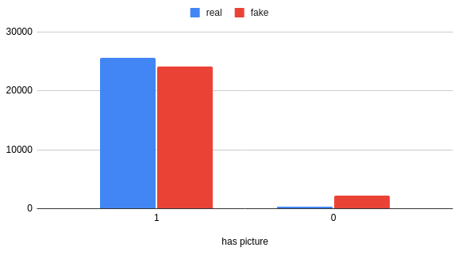

# Inteligencia Artificial I - Informe Proyecto Final.

## Heartbreak: Modelo para detectar cuentas falsas de Instagram

**Integrantes:** 
  - Nahuel Arrieta
  - Leonel Castinelli.

## Descripción

El proyecto consta  de generar un modelo que pueda predecir si una cuenta de la red social Instagram es falsa (ya sea un bot o tenga seguidores comprados). Se utilizará un algoritmo de machine learning entrenado con un dataset de la plataforma kaggle (https://www.kaggle.com/datasets/krpurba/fakeauthentic-user-instagram) el cuál ha recopilado datos de 65326 usuarios reales o auténticos y falsos desde el 1 al 20 de septiembre de 2019, lo cual prueba ser de grán utilidad ya que contiene muchas métricas de cada usuario. Además de ser muy extensa, contiene datos de utilidad como: 

- Average Caption length: Longitud promedio de descripción en publicaciones.

- Average Hashtags count: Cantidad promedio de hashtags en publicaciones.

- Biography length: Longitud de la biografía.

- Caption Zero: Porcentaje de publicaciones con longitud de la descripición menor a 4 caracteres.

- Comments engagement rate: (número de comentarios) dividido por (número de publicaciones) dividido por (número de seguidores).

- Cosine similarity: Similaridad coseno promedio entre cada par de publicaciones.

- Follower keywords: Uso promedio de palabras "follower hunter" (follow, like, folback, follback, f4f) por publicación.

- Has Picture: Si la cuenta tiene imagen de perfil.

- Like engagement rate: (número de likes) dividido por (número de publicaciones) dividido por (número de seguidores).

- Link Availibility: Si la cuenta tiene un link externo.

- Location tag percentage: Porcentaje de publicaciones con tag de ubicación.

- Non image post percentage: Porcentaje de publicaciones que no son imágenes (video, carousel).

- Number of followers: Número de seguidores.

- Number of followings: Número de seguidos.

- Number of posts: Número de publicaciones.

- Post interval: Intervalo de tiempo en horas entre publicaciones.

- Promotional keywords: Uso promedio de palabras "promocionales" (regrann, contest, repost, giveaway, mention, share, give away, quiz) por publicación.

## Investigación 

### Análisis de la features del dataset

- Average Caption length (en escala logarítmica)

- Average Hashtags count (en escala logarítmica)

- Biography length 

- Caption Zero 

- Comments engagement rate (en escala logarítmica)

- Cosine similarity

- Follower keywords (en escala logarítmica)

- Has Picture

- Like engagement rate (en escala logarítmica)

- Link Availibility

- Location tag percentage

- Non image post percentage

- Number of followers (en escala logarítmica)

- Number of followings 

- Number of posts (en escala logarítmica)

- Post interval (en escala logarítmica)

- Promotional keywords (en escala logarítmica)

#### Conclusiones

- La distribución de las clases (real o fake) es equitativa, lo cual es bueno para el entrenamiento del modelo.

- Podría considerarse utilizar como feature la diferencia entre el número de seguidores y seguidos (followers - following).

- La característica "Caption Zero" no es muy útil ya que los unicos valores que toma son 0 y 1. Además algunos datos son incorrectos ya que hay 83 cuentas que no tienen descripcion en sus publicaciones (la longitud promedio de descripción en publicaciones es 0) pero el valor de la característica es 0.

- Las siguientes características tienen una distribución muy similar entre las clases real y fake. En principio, no serían muy útiles para el entrenamiento del modelo.

  - Non image post percentage
  - Location tag percentage
  - Comments engagement rate

- Las siguientes características tienen una distribución muy diferente entre las clases real y fake. Podrían ser muy útiles para el entrenamiento del modelo.

  - Biography length 
  - Follower keywords
  - Has Picture
  - Link Availibility
  - Promotional keywords 